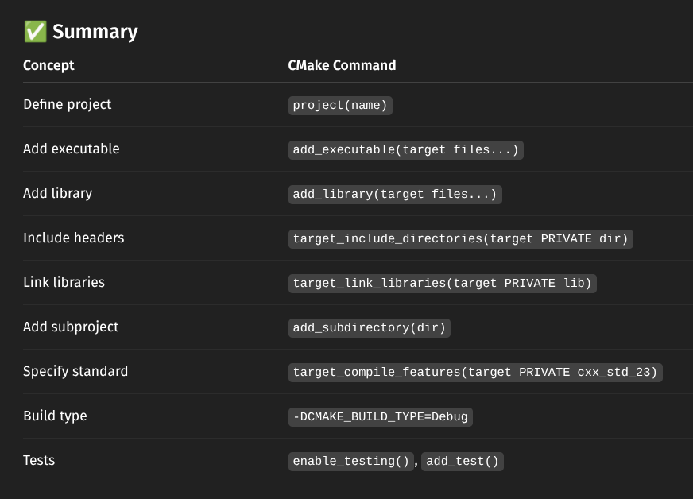
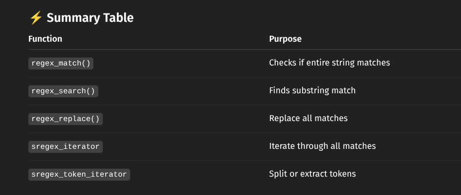
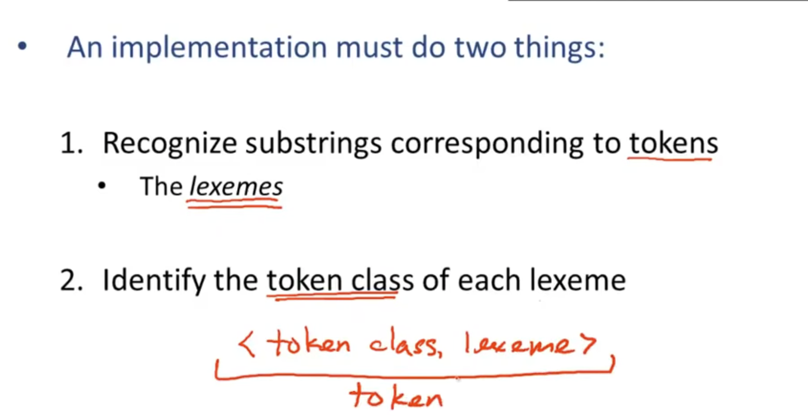
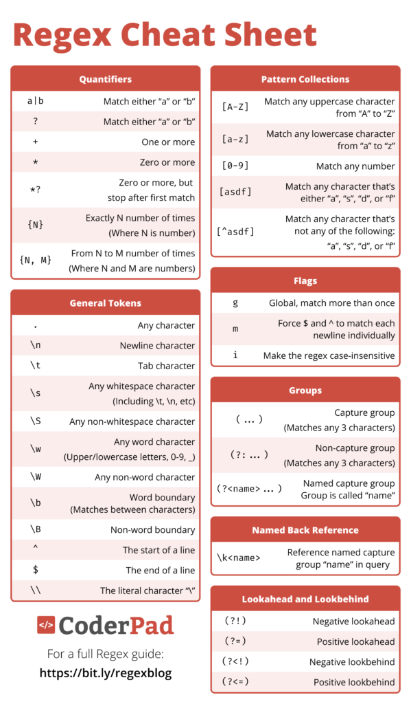
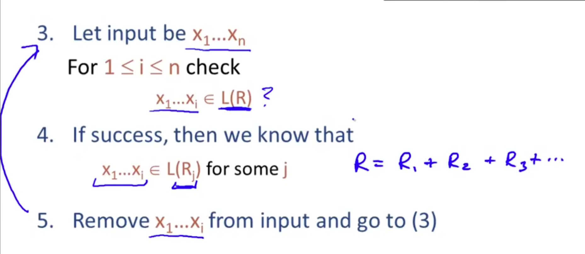
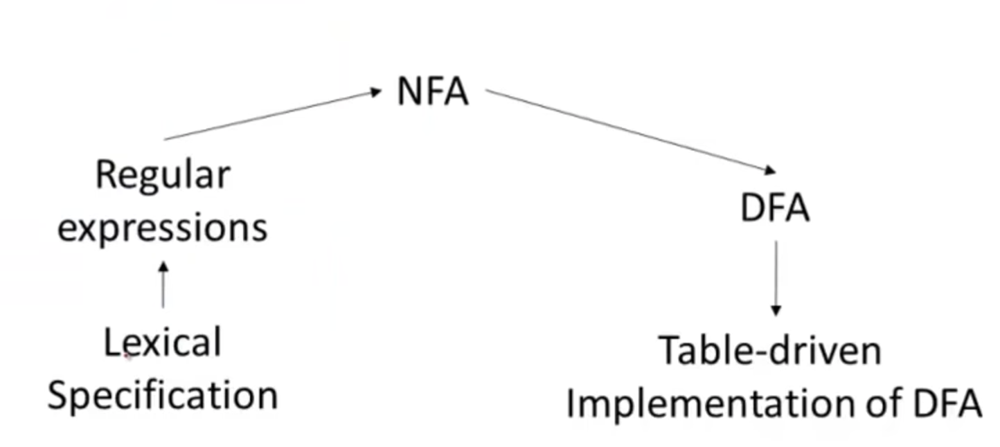

# Modern C++
[Smart Pointers Video](https://www.youtube.com/watch?v=UOB7-B2MfwA&list=PLlrATfBNZ98dudnM48yfGUldqGD0S4FFb&index=45)

<!--  -->
Unique pointer is destroyed after its scope ends. You can't assign another object to an existing unique pointer

Shared pointer is destroyed after its reference count becomes 0

Weak pointers

# cmake

# regex

# lexer 

# parser

What we want is for the `else`s to associate with the closest matching `if`

## Abstract Syntax Tree

## Recursive Descent Parsing (top-down parsing algorithm)

---
Match!

...

---

Left-recursive grammar does it from right to left, but Recursive Descent Parsing works from left to right, so Left-recursive grammar doesn't work for Recursive Descent Parsing\

---
## LL LR Parsing

### Predictive Parsing

> The general idea is we factor out the common prefix, one production deals with the prefix, and then we introduce a new terminal for the suffixes and just have multiple productions, one for each possible suffix. Delays decision about which production we're using, so instead of having to decide immediately which production to use 

---

#### First Sets

But since `T` doesn't have a terminal, we can say `First(E) = First(T)` instead of `First(T)` being a subset of `First(E)` 

#### Follow Sets

We don't include `eps` in follow sets, but consider for **computing** follow sets

